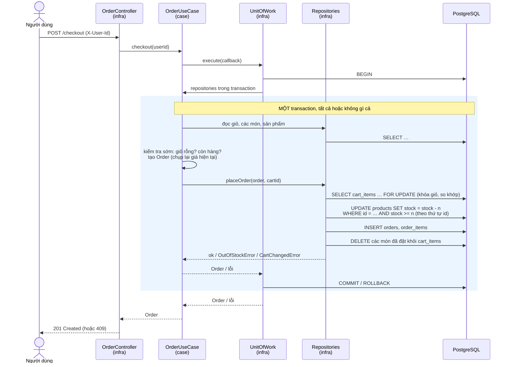

# Giỏ hàng & Thanh toán: thiết kế và xử lý race condition

Tài liệu mô tả luồng **sản phẩm → giỏ hàng → thanh toán → đơn hàng**: code nằm ở tầng nào, các API, và cách hệ thống đảm bảo **không bán quá số hàng trong kho** khi nhiều người mua cùng lúc.

---

## 1. Chạy thử nhanh

```bash
pnpm install
cp .env.example .env        # Windows PowerShell: Copy-Item .env.example .env
pnpm db:up                  # bật PostgreSQL bằng Docker
pnpm build && pnpm start    # lần chạy đầu tự tạo bảng (migration)
pnpm db:seed                # (terminal khác) nạp sản phẩm mẫu / đặt lại tồn kho
pnpm test                   # 40 unit test của tầng use case
pnpm race                   # demo race condition: 20 người cùng mua 5 chiếc điện thoại
```

> ⚠️ **Tạm thời**: các API giỏ hàng/đơn hàng nhận biết người dùng qua header `X-User-Id: <id user>`, là id trả về khi gọi `POST /auth/register`. Cách này **không an toàn** vì ai cũng gửi được id bất kỳ. Nó chỉ dùng để test trong lúc chờ guard JWT (phần của An). Khi guard xong, chỉ cần sửa một file: `infra/src/nest/common/decorators/CurrentUserId.decorator.ts`.

---

## 2. Các API

| Method | Đường dẫn | Cần `X-User-Id` | Mô tả | Lỗi có thể gặp |
|---|---|:-:|---|---|
| GET | `/categories` | | Danh sách danh mục | |
| GET | `/products?categoryId=…` | | Danh sách sản phẩm (lọc theo danh mục nếu có) | 404 danh mục không tồn tại |
| GET | `/products/:productId` | | Chi tiết sản phẩm | 404 |
| GET | `/cart` | ✓ | Xem giỏ (tự tạo nếu chưa có) + tổng tiền | 404 user không tồn tại |
| POST | `/cart/items` | ✓ | Thêm `{ productId, quantity }`, cộng dồn nếu đã có | 400 số lượng sai · 404 · 409 vượt tồn kho |
| PATCH | `/cart/items/:productId` | ✓ | Đổi số lượng `{ quantity }` | 400 · 404 chưa có trong giỏ · 409 |
| DELETE | `/cart/items/:productId` | ✓ | Xóa một món | 404 |
| DELETE | `/cart` | ✓ | Xóa hết giỏ | |
| POST | `/checkout` | ✓ | Đặt hàng toàn bộ giỏ → **201** + đơn hàng | 409 `EmptyCartError` · 409 `OutOfStockError` (kèm `productIds`) · 409 `CartChangedError` |
| GET | `/orders` | ✓ | Đơn hàng của tôi (mới nhất trước) | |
| GET | `/orders/:orderId` | ✓ | Chi tiết đơn | 404 (cả khi đơn là của người khác) |

Tiền tệ là **VND, số nguyên**. Không dùng số thực để tránh sai số làm tròn.

Ví dụ:

```bash
curl -X POST localhost:3000/auth/register -H "content-type: application/json" \
     -d '{"username":"hai123","password":"Abcdef@12345"}'            # → lấy "id"
curl -X POST localhost:3000/cart/items -H "content-type: application/json" \
     -H "x-user-id: <id>" -d '{"productId":"prod-tshirt","quantity":2}'
curl -X POST localhost:3000/checkout -H "x-user-id: <id>"
```

---

## 3. Code nằm ở tầng nào

```
domain/src/            ← LÕI: đối tượng + quy tắc + port (interface)
  product.ts, category.ts, cart.ts, cartItem.ts, order.ts
  shared.ts            ← các lỗi nghiệp vụ: NotFoundError, OutOfStockError, EmptyCartError…

case/src/              ← USE CASE: các bước của từng nghiệp vụ
  product.ts           ProductUseCase
  cart.ts              CartUseCase
  order.ts             OrderUseCase (checkout)
  ports.ts             IdGenerator (port sinh id)
case/test/             ← unit test với repository giả (in-memory), không cần DB

infra/src/nest/        ← ADAPTER
  modules/product|cart|order/
    *.controller.ts    adapter đầu vào: HTTP → use case
    *.dto.ts           hình dạng dữ liệu vào/ra + luật kiểm tra
    *.repository.ts    adapter đầu ra: port → PostgreSQL (TypeORM)
    *.module.ts        "cắm" adapter vào port (Dependency Injection)
  common/filters/DomainError.filter.ts   lỗi nghiệp vụ → mã HTTP (400/404/409)
  modules/app/migrations/…-cart-and-order.ts   tạo bảng
```

Hướng phụ thuộc: `infra → case → domain`. Tầng `domain` và `case` **không biết** NestJS, HTTP hay PostgreSQL. Bằng chứng là 40 unit test chạy use case với repository giả trong bộ nhớ, không cần server hay database (`case/test/fakes.ts`).

### Ví dụ ranh giới trách nhiệm: lỗi "hết hàng"

1. `OrderRepository.placeOrder` (adapter DB) phát hiện hết hàng và ném `OutOfStockError`. Đây là **lỗi nghiệp vụ**, không phải lỗi SQL.
2. `OrderUseCase.checkout` để lỗi đi qua.
3. `DomainErrorFilter` (adapter HTTP) đổi thành `409 Conflict`.

Không tầng nào phải biết việc của tầng khác.

---

## 4. Luồng thanh toán



---

## 5. Race condition và cách xử lý

**Race condition** là lỗi xảy ra khi kết quả phụ thuộc vào *thứ tự* của các thao tác chạy đồng thời.

### 5.1. Bài toán chính: bán quá số hàng (overselling)

Còn **1** cuốn sách, A và B bấm "Thanh toán" cùng lúc. Cách làm ngây thơ:

```
A: đọc stock = 1  → "còn hàng"         B: đọc stock = 1  → "còn hàng"
A: ghi stock = 0, tạo đơn              B: ghi stock = 0, tạo đơn     ← bán 2 cuốn!
```

Kiểm tra `if (stock >= n)` trong code **không đủ**: giữa lúc *đọc* và lúc *ghi*, người khác đã kịp đọc cùng giá trị cũ.

**Cách xử lý: gộp "kiểm tra" và "trừ" thành một câu lệnh nguyên tử trong database:**

```sql
UPDATE products SET stock = stock - 1 WHERE id = 'prod-last-one' AND stock >= 1;
```

- PostgreSQL **khóa dòng** sản phẩm khi cập nhật. Câu lệnh của B phải **chờ** transaction của A kết thúc.
- Sau khi A commit, PostgreSQL **kiểm tra lại** điều kiện `stock >= 1` với giá trị mới là `0`. Điều kiện sai, nên có **0 dòng** bị cập nhật.
- Code thấy 0 dòng thì ném `OutOfStockError`. Transaction của B bị **rollback** và B nhận `409`.

Code: `TypeOrmOrderRepository.placeOrder` trong `infra/src/nest/modules/order/Order.repository.ts`. Transaction được tạo bởi `TypeOrmUnitOfWork` trong `infra/src/database/TypeOrmUnitOfWork.ts`; xem [Unit of Work](unit-of-work.md).

Use case vẫn kiểm tra tồn kho sớm (`hasEnoughStock`). Bước này chỉ giúp báo lỗi nhanh trong trường hợp thường gặp; **bảo đảm thật nằm ở câu UPDATE**. Trong lần chạy thử `pnpm race` với 20 người, cả 15 người mua hụt đều vượt qua bước kiểm tra sớm (vì cùng đọc thấy "còn 5") và chỉ bị chặn ở database (log server ghi 15 lần ROLLBACK).

### 5.2. Đơn nhiều món: "tất cả hoặc không gì cả"

Giỏ có điện thoại (còn hàng) và sách (hết hàng). Nếu đã trừ kho điện thoại rồi mới phát hiện sách hết, thì kho điện thoại bị trừ oan.

**Cách xử lý:** `OrderUseCase.checkout` dùng `UnitOfWork.execute`, từ bước đọc giỏ đến `placeOrder`, trong **một transaction**. Chỉ cần một món thiếu hàng là toàn bộ bị rollback: kho các món khác được trả lại, không có đơn nào được tạo. Script `pnpm race` kiểm tra đúng điều này qua sản phẩm `prod-clean-code`: kho chỉ giảm đúng bằng số đơn thành công.

### 5.3. Deadlock khi nhiều đơn cùng chứa nhiều món

A mua [áo, sách], B mua [sách, áo]. A khóa áo rồi chờ sách, B khóa sách rồi chờ áo: **hai bên chờ nhau mãi (deadlock)**.

**Cách xử lý:** luôn trừ kho **theo thứ tự id sản phẩm** bất kể thứ tự trong giỏ. Khi đó mọi transaction khóa theo cùng một thứ tự, không thể có vòng chờ. Script `pnpm race` thêm hàng vào giỏ theo thứ tự ngẫu nhiên để kiểm chứng; kết quả là 0 deadlock.

### 5.4. Giỏ bị sửa trong lúc đang thanh toán

Người dùng mở 2 tab: tab 1 bấm thanh toán, tab 2 đổi số lượng cùng lúc. Đơn có thể lệch với giỏ.

**Cách xử lý:** trong transaction, `SELECT … FOR UPDATE` **khóa các dòng của giỏ** rồi so khớp với đơn. Nếu lệch thì ném `CartChangedError` (409), người dùng xem lại giỏ và thử lại. Chỉ xóa khỏi giỏ **những món đã đặt**; món vừa thêm từ tab khác vẫn được giữ.

### 5.5. Hai race condition nhỏ khi thêm vào giỏ

| Tình huống | Hậu quả nếu làm ngây thơ | Cách xử lý |
|---|---|---|
| Hai request đầu tiên của một user cùng tạo giỏ | 2 giỏ cho 1 user | `UNIQUE(user_id)` + `INSERT … ON CONFLICT DO NOTHING` (`insertIfAbsent`) |
| Bấm "Thêm vào giỏ" 2 lần thật nhanh | 2 dòng cho cùng 1 sản phẩm | `UNIQUE(cart_id, product_id)` + `INSERT … ON CONFLICT DO UPDATE SET quantity = quantity + n` (upsert) |

### 5.6. Chốt chặn cuối: ràng buộc trong database

`CHECK (stock >= 0)`, `CHECK (quantity > 0)`, `UNIQUE`, khóa ngoại… (xem migration). Kể cả khi code có bug, database cũng **từ chối** dữ liệu sai.

### 5.7. So sánh với các cách khác

| Cách | Ý tưởng | Ưu | Nhược | Dùng ở đây? |
|---|---|---|---|---|
| **UPDATE có điều kiện** (atomic) | Kiểm tra + trừ trong 1 câu SQL | Đơn giản, nhanh, không cần thêm cột | Logic kiểm tra nằm trong SQL | ✅ trừ kho |
| **Pessimistic lock** (`SELECT … FOR UPDATE`) | Khóa dòng trước khi đọc | Dễ hiểu, kiểm tra phức tạp được trong code | Giữ khóa lâu hơn, dễ deadlock nếu khóa lộn thứ tự | ✅ khóa giỏ |
| **Optimistic lock** (cột `version`) | Ghi kèm điều kiện `version = v`, lệch thì thử lại | Không khóa, tốt khi ít tranh chấp | Hàng "hot" (flash sale) thì phải thử lại liên tục | ❌ |
| **Isolation SERIALIZABLE** | Để DB tự phát hiện xung đột | Không phải nghĩ từng trường hợp | Phải tự viết vòng thử lại, chậm hơn | ❌ |
| **Hàng đợi / Redis lock** | Xếp các đơn vào một hàng xử lý tuần tự | Chịu tải rất lớn | Thêm hạ tầng, phức tạp | ❌ (quá mức cần thiết) |

---

## 6. Kiểm thử

| Loại | Lệnh | Kiểm tra gì |
|---|---|---|
| Unit test | `pnpm test` | 40 test cho `ProductUseCase`, `CartUseCase`, `OrderUseCase`, `Order`, `Product` với repository giả |
| Race condition (end-to-end) | `pnpm db:seed && pnpm race 50` | N người cùng thanh toán sản phẩm còn 5 chiếc |

Kết quả `pnpm race 50` (server + PostgreSQL thật):

```
Stock before: prod-flash-sale=5, prod-clean-code=50
All 50 buyers press "Checkout" at the same moment...
  201 order placed: 5
  409 OutOfStockError: 45
Stock after:  prod-flash-sale=0, prod-clean-code=45
PASS  successful orders = min(buyers, stock) = 5
PASS  every other buyer got 409 Conflict
PASS  prod-flash-sale stock = 5 - 5, never negative
PASS  prod-clean-code stock dropped only for successful orders (failed orders rolled back)
```

---

## 7. Giới hạn và việc còn lại

- **Xác thực:** header `X-User-Id` là tạm thời, cần thay bằng guard JWT (An).
- **Thêm vào giỏ không giữ hàng:** kiểm tra tồn kho lúc thêm chỉ để báo sớm. Hàng chỉ thực sự bị trừ khi thanh toán (giống Shopee: "còn hàng" trong giỏ chưa chắc mua được).
- **Giá:** đơn hàng lấy giá **tại thời điểm thanh toán** và lưu lại (`order_items.unit_price`). Đổi giá sau đó không ảnh hưởng đơn cũ.
- **Chưa có thanh toán thật** (cổng thanh toán, trạng thái đơn, hủy đơn / hoàn kho).
- **Chưa có API quản trị** thêm/sửa sản phẩm; dữ liệu mẫu nạp bằng `pnpm db:seed`.
